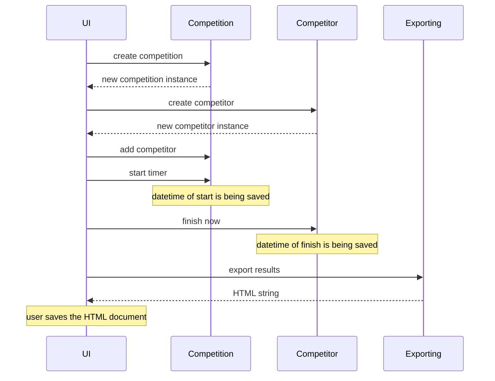

# Architecture

## Structure

The project consists of three architecture layers: UI, logics and repositories.
Logics is divided into two smaller parts, services and entities, which are responsible for handling and storing data, respectively.
Repositories layer, on the other hand, stores the data permanently to the remote database via API.

The package diagram of the project is as follows:

## Logics

Services package contains modules that are all responsible for a single logical operation:

* [`exporting`](/src/services/exporting.py) takes in a competition and produces start and result lists as export-ready HTML strings.
* [`login`](/src/services/login.py) handles the login token: generates it from given credentials, saves it to a file and reads it from there later
* [`request`](/src/services/request.py) module contains a simple class making HTTP requests to the server
* [`timedelta-format`](/src/services/timedelta-format.py) consists of a single function that converts a timedelta instance into a readable string

Entities package consists of two classes that store data in a short term:

* [`competition`](/src/entities/competition.py) holds data about a single competition.
* [`competitor`](/src/entities/competitor.py) holds data about a single participant of a competition. One Competition class holds a list of Competitor instances.

### Login token

There is no real user accounts in the application.
Instead, it asks for a username and password, and then converts these into a unique _login token_ using SHA-256 hashing algorithm.
Each competition created is then associated with a token like this, after which everyone with the correct token (i.e. correct username-password pair) can edit the competition.

The string that is being hashed to generate the token consists of the username and password separated by a single `#` character.
Therefore the username must not contain this character,
or else there could be collisions with different username-password pairs:
for example pairs `user#name`-`password` and `user`-`name#password` would both lead to hash string of `user#name#password`.

## Competition sequence diagram

The following sequence diagram depicts the flow of managing a competition.

