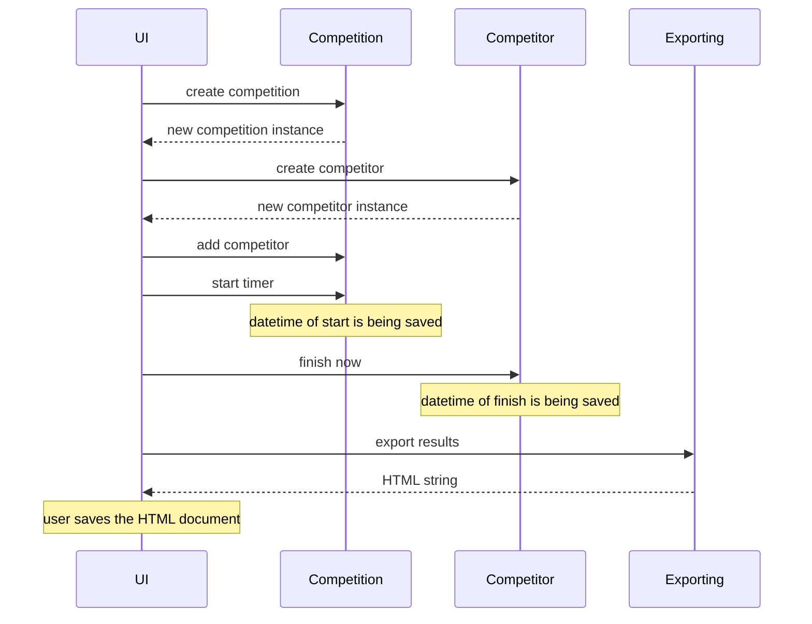

# Architecture

## Package diagram

## Competition sequence diagram

The following sequence diagram depicts the flow of managing a competition.

```mermaid
sequenceDiagram
  UI->>Competition: create competition
  Competition-->>UI: new competition instance
  UI->>Competitor: create competitor
  Competitor-->>UI: new competitor instance
  UI->>Competition: add competitor
  UI->>Competition: start timer
  note over Competition: datetime of start is being saved
  UI->>Competitor: finish now
  note over Competitor: datetime of finish is being saved
  UI->>Exporting: export results
  Exporting-->>UI: HTML string
  note over UI: user saves the HTML document
```
