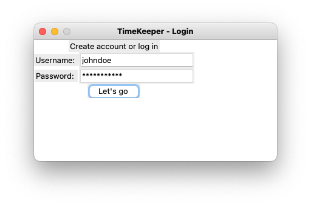
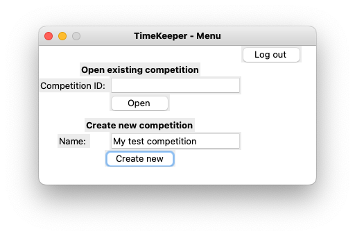
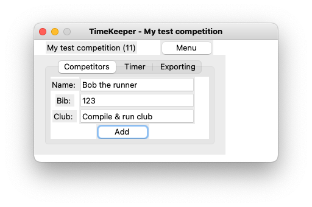
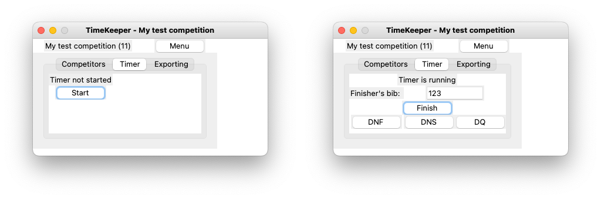
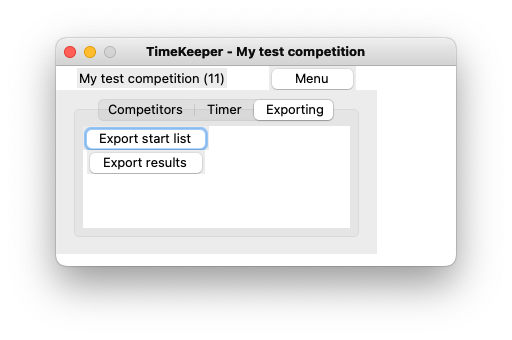

# User manual

## Download and installation

Make sure that your Python version is at least 3.8 and that you have [Poetry](https://python-poetry.org/) installed.

Download the application from [releases](https://github.com/PyryL/ot-harjoitustyo/releases/latest) and unzip the downloaded archive.

Install the application by running `poetry install` in the unzipped directory.

## Launching the application

After installing the application, you can start it by running

```
poetry run invoke start
```

## Sign up or log in

When first time launching the application, user has to sign up or log in.
Both of these actions are done using the same form depicted in the image below.



User can choose any username that does not contain `#` character.
Password is recommended to be strong, that is, long enough and containing special characters.

## Menu

After logging in, menu is opened automatically.
Here one can either open an existing competition using its ID
or create a new one by giving its title.
Both of these actions open the competition view.



## Competition

In competition view next to the title of the competition is the ID of the competition in parentheses.
This is an important piece of information, as this is the way of accessing the competition next time.
It is recommended to write the ID down after creating a new competition.

### Adding competitors
User adds one or more competitors in Competitors tab.
This is done by giving at least name and bib number information and the clicking the Add button.



### Timer

In the Timer tab, user can start the competition timer.
After that, one can mark the finish time for competitors using their bib number.
Competitor can also be marked with DNF (did not finish), DNS (did not start) or DQ (disqualified).



### Exporting

In Exporting tab, user can export HTML documents containing start list and results of the competition.
The exported document is instantly ready to be published in the internet site of the competition host, for instance.


