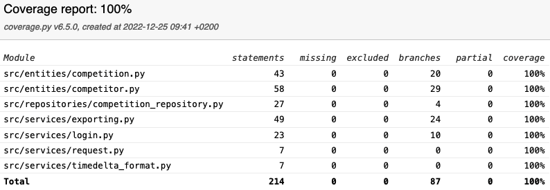

# Tests

The application has both unit and integration tests, which are both located in [`/src/tests/`](../src/tests) directory. In addition, manual testing was carried out.

## Unit and integration tests

### Services

[`Request`](../src/services/request.py) class is [tested](../src/tests/request_test.py) to correctly send an HTTP request to the server.

[`format_timedelta`](../src/services/timedelta_format.py) function is [tested](../src/tests/timedelta_format_test.py) to produce a wanted string. There are tests for different kinds of possible inputs.

[`Login`](../src/services/login.py) class' functionality to generate login tokens and save them to a local file is [tested](../src/tests/login_test.py) in various ways.

[`Exporting`](../src/services/exporting.py) class is [tested](../src/tests/exporting_test.py) with BeautifulSoup library to output HTML documents that have correct structure and content.

### Repositories

[`CompetitionRepository`](../src/repositories/competition_repository.py) class is [tested](../src/tests/competition_repository_test.py) to make correct HTTP requests to read and write data with servers. Normally this class has [`Request`](../src/services/request.py) service as a dependency, but in the tests stubs are used instead.

### Entities

[`Competitor`](../src/entities/competitor.py) entity is [tested](../src/tests/competitor_test.py) to store data in correct format but also to produce correct dictionary representation of itself.

[`Competition`](../src/entities/competition.py) entity is [tested](../src/tests/competition_test.py) to store data and manage dictionary representations as expected.

### Branch coverage

When user interface, tests, assets and driver code are [ignored](../.coveragerc), the branch coverage is 100%.

## System tests

Manual testing was carried out in all phases of the development. The application was installed to macOS, Debian, Ubuntu and Windows operating systems and tested to be functional. Testing same account on multiple devices was done to make sure that communication with servers is flawless.

## Existing problems

Currently [`Login`](../src/services/login.py) class in services package handles reading and writing the local file itself. For better testability, file IO should be extracted to own service.

System-wide testing could be automatized by using a dedicated library such as Robot framework.

Reliability could be improved in situations where user has logged in on multiple devices at the same time. At the moment all changes are not synchronized between users.
