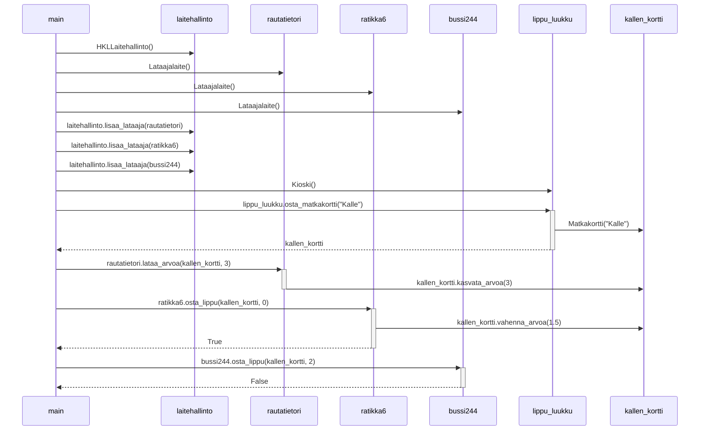

# Matkakortti

```mermaid
sequenceDiagram
  main ->> laitehallinto: HKLLaitehallinto()
  main ->> rautatietori: Lataajalaite()
  main ->> ratikka6: Lataajalaite()
  main ->> bussi244: Lataajalaite()
  
  main ->> laitehallinto: laitehallinto.lisaa_lataaja(rautatietori)
  main ->> laitehallinto: laitehallinto.lisaa_lataaja(ratikka6)
  main ->> laitehallinto: laitehallinto.lisaa_lataaja(bussi244)
  
  main ->> lippu_luukku: Kioski()
  main ->>+ lippu_luukku: lippu_luukku.osta_matkakortti("Kalle")
  lippu_luukku ->> kallen_kortti: Matkakortti("Kalle")
  lippu_luukku -->>- main: kallen_kortti
  
  main ->>+ rautatietori: rautatietori.lataa_arvoa(kallen_kortti, 3)
  rautatietori ->>- kallen_kortti: kallen_kortti.kasvata_arvoa(3)
  
  main ->>+ ratikka6: ratikka6.osta_lippu(kallen_kortti, 0)
  ratikka6 ->> kallen_kortti: kallen_kortti.vahenna_arvoa(1.5)
  ratikka6 -->>- main: True
  
  main ->>+ bussi244: bussi244.osta_lippu(kallen_kortti, 2)
  bussi244 -->>- main: False
```
