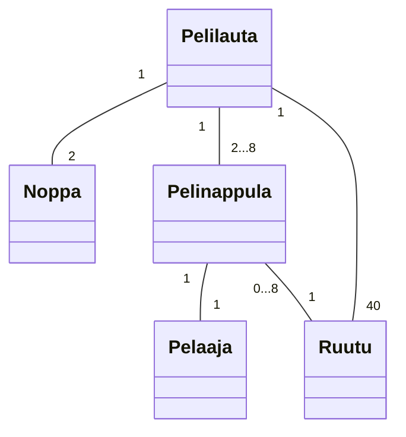
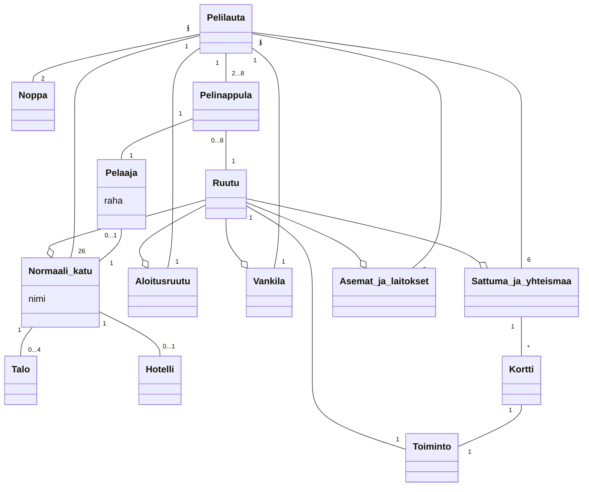

# Monopoli

## Tehtävä 1

```mermaid
classDiagram
  Pelilauta "1" -- "2" Noppa
  Pelilauta "1" -- "2...8" Pelinappula
  Pelinappula "1" -- "1" Pelaaja
  Pelinappula "0...8" -- "1" Ruutu
  Pelilauta "1" -- "40" Ruutu
```

## Tehtävä 2

```mermaid
classDiagram
  Pelilauta "1" -- "2" Noppa
  Pelilauta "1" -- "2...8" Pelinappula
  Pelinappula "1" -- "1" Pelaaja
  Pelinappula "0...8" -- "1" Ruutu
  Pelaaja "0...1" -- "1" Normaali_katu
  Normaali_katu "1" -- "0...4" Talo
  Normaali_katu "1" -- "0...1" Hotelli
  Pelilauta "1" -- "26" Normaali_katu
  Pelilauta "1" -- "1" Aloitusruutu
  Pelilauta "1" -- "1" Vankila
  Pelilauta "1" -- "6" Sattuma_ja_yhteismaa
  Pelilauta "1" -- "6" Asemat_ja_laitokset
  Ruutu --o Normaali_katu
  Ruutu --o Aloitusruutu
  Ruutu --o Vankila
  Ruutu --o Sattuma_ja_yhteismaa
  Ruutu --o Asemat_ja_laitokset
  Sattuma_ja_yhteismaa "1" -- "*" Kortti
  Kortti "1" -- "1" Toiminto
  Ruutu "1" -- "1" Toiminto
  
  class Pelaaja {
    raha
  }
  class Normaali_katu {
    nimi
  }
```
