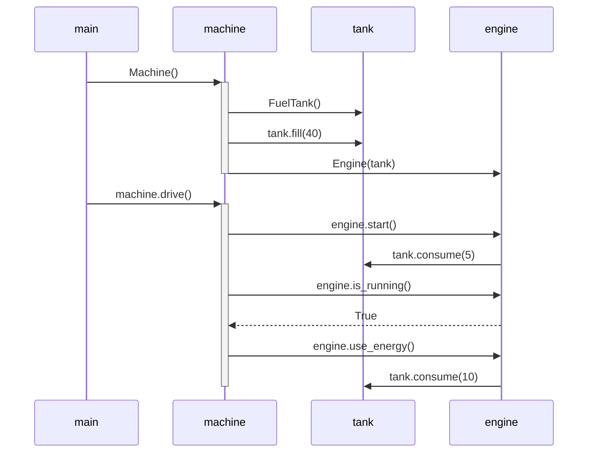

# Polttoaine

```mermaid
sequenceDiagram
  main ->>+ machine: Machine()
  machine ->> tank: FuelTank()
  machine ->> tank: tank.fill(40)
  machine ->>- engine: Engine(tank)
  
  main ->>+ machine: machine.drive()
  machine ->> engine: engine.start()
  engine ->> tank: tank.consume(5)
  machine ->> engine: engine.is_running()
  engine -->> machine: True
  machine ->> engine: engine.use_energy()
  engine ->> tank: tank.consume(10)
  deactivate machine
```
